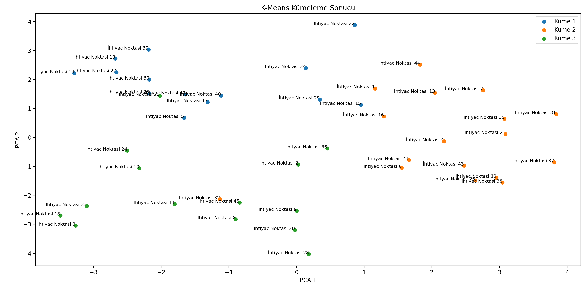
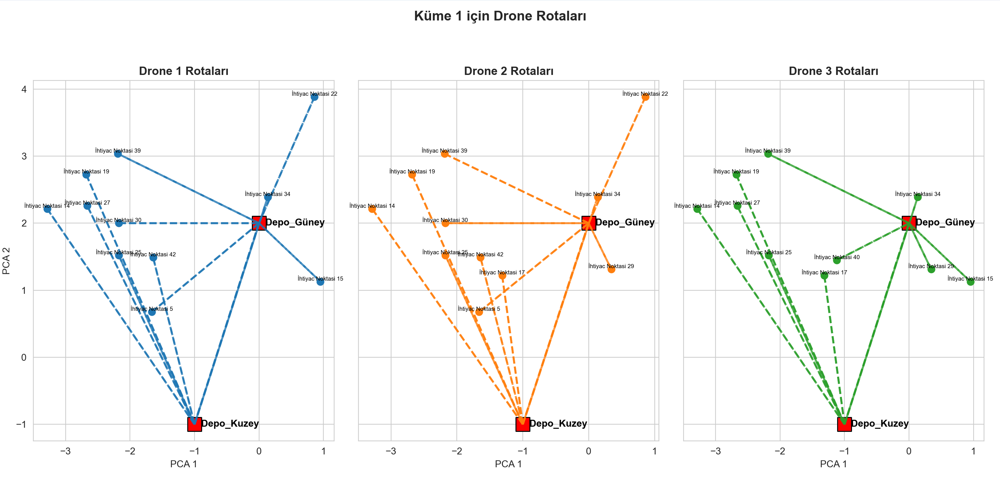
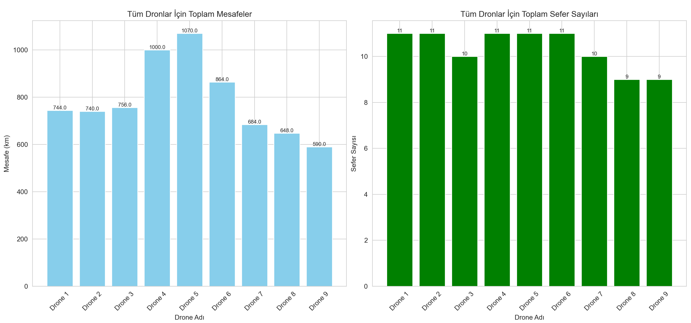

# Drone-Based-Post-Earthquake-Humanitarian-Aid-Distribution-Optimization
AI-powered optimization for drone-based humanitarian aid distribution in post-earthquake scenarios. Uses K-Means clustering and Dijkstra’s algorithm for efficient routing.
# **Drone-Based Post-Earthquake Humanitarian Aid Distribution Optimization**

## **Project Overview**

This project focuses on optimizing the **distribution of humanitarian aid** using drones in **post-earthquake scenarios**. By implementing **AI-driven clustering and route optimization**, the system ensures efficient and fast delivery of critical supplies to affected areas.

## **Technologies Used**

- **Programming Language**: Python
- **Machine Learning**: K-Means Clustering
- **Graph Algorithms**: Dijkstra's Algorithm for shortest path calculation
- **Data Processing**: Pandas, NumPy
- **Visualization**: Matplotlib, Seaborn
- **Graph Analysis**: NetworkX

## **How It Works**

1. **Data Processing**: The system loads demand and warehouse locations from datasets.
2. **Clustering**: The K-Means algorithm groups need points into clusters for efficient routing.
3. **Shortest Path Calculation**: Dijkstra’s algorithm finds the best routes between need points and warehouses.
4. **Route Assignment**: Drones are assigned optimal routes based on demand and distance constraints.
5. **Visualization**: Outputs include **graphs, heatmaps, and route analysis** to assess delivery efficiency.

## **Installation & Setup**

### **Requirements**

Ensure you have Python installed along with the necessary dependencies. You can install them using:

```bash
pip install -r requirements.txt
```

### **Running the Project**

To execute the project, run:

```bash
python yotproje.py
```

This will generate **optimized drone routes, cluster visualizations, and performance metrics**.

## **Project Outputs**

- **Clustered Need Points Visualization**: Displays how aid locations are grouped.
- 
- **Optimized Drone Routes**: Shows shortest paths calculated for each drone.
- 
- **Performance Metrics**: Includes total travel distance, number of deliveries, and efficiency analysis.
- 

